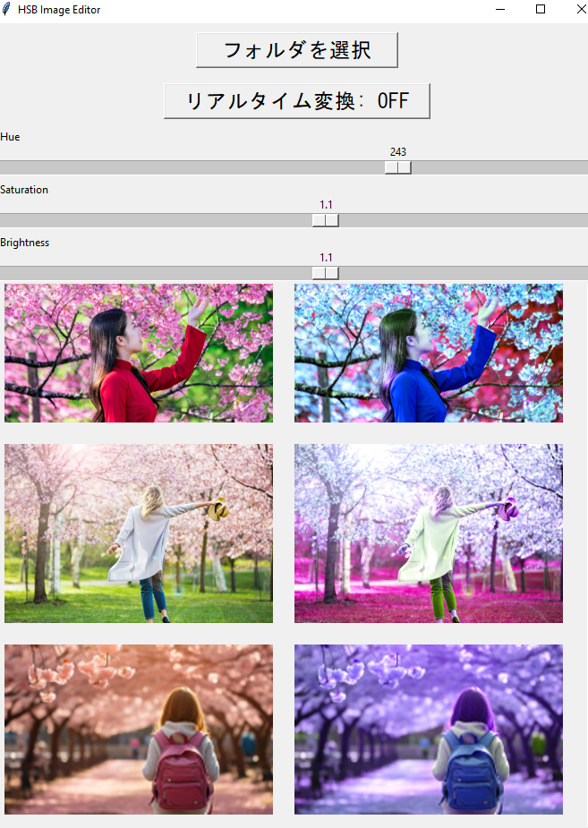
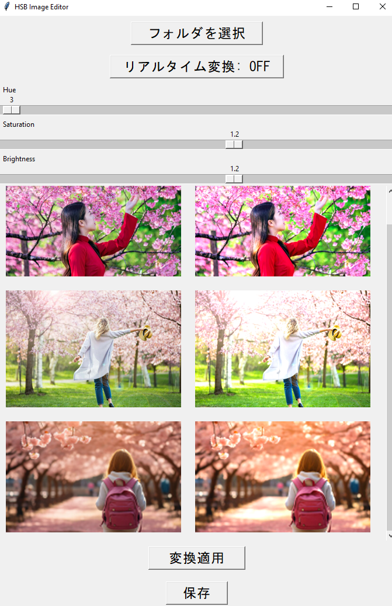
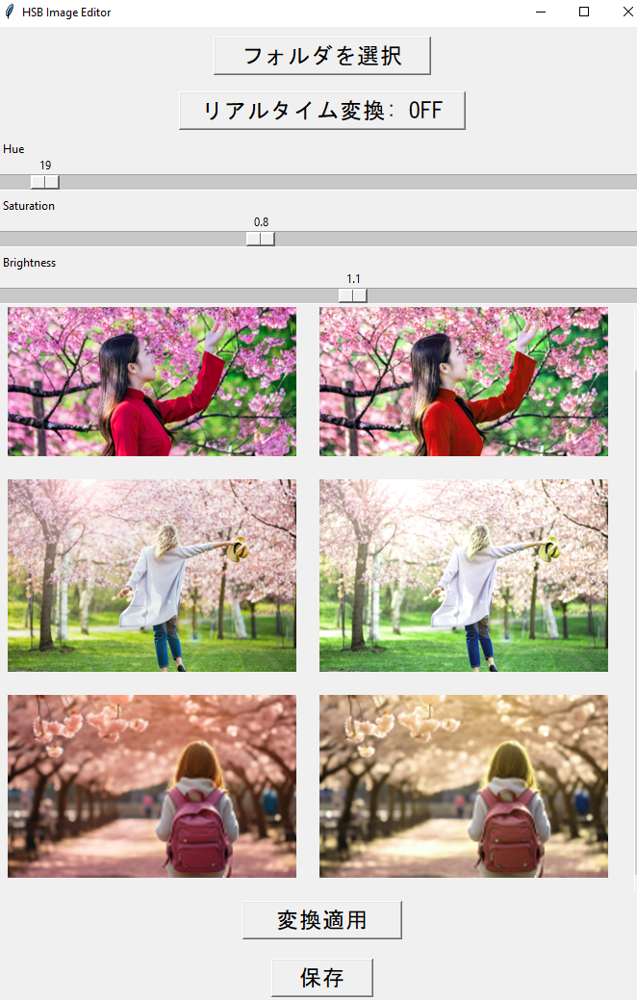
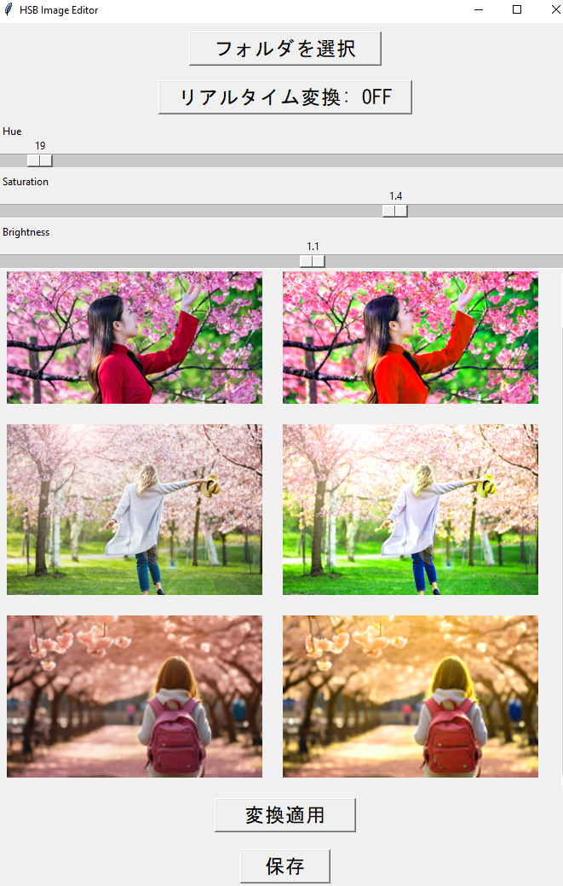
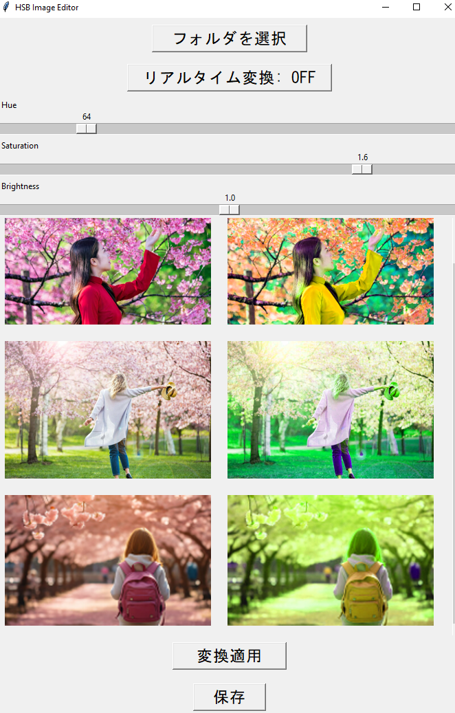

# python-image-HSB-Processor
A python tool that substitutes for expensive image processing AI services

## Getting Started

### Prerequisites

Have to install the Python on Your PC.

### Installation

Please following Step to build the application.

1. Clone the repo
   ```sh
   git clone https://github.com/high-mountains/python-image-HSB-Processor.git
   ```

3. Install PyInstaller
   ```sh
   pip install pyinstaller
   ```

3. Modify the Script (Optional)
    Since you're happy with the current functionality of your script, no significant changes are needed. However, it's good practice to ensure the program exits cleanly when the user closes it, which Tkinter handles automatically.

4. Package the Script

    ```sh
    pyinstaller --onefile --windowed your_script_name.py
    ```
5. (Optional) Customize the Icon

    If you'd like to give the program a custom icon, you can do so by including the --icon flag with your icon file:
    
    ```sh
    pyinstaller --onefile --windowed --icon=your_icon.ico your_script_name.py
    ```

## Please Enjoy
    Then you can see what you want to get.

<p align="center">
  
  
  
  
  
    <video src="./assets/video.mp4" width="600" />
</p>


    